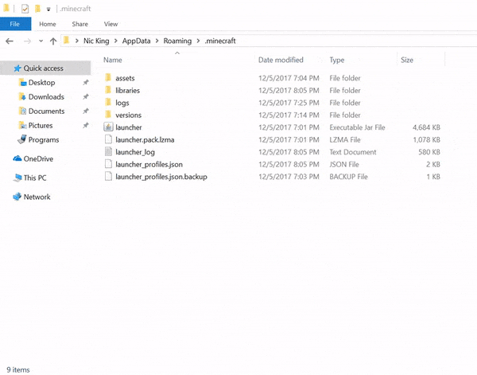

## Intro
 Dungeon Rooms Mod can be installed in the same way as other Forge mods, by dragging the mod jar into the mod folder. And no, you cannot use this mod with Badlion or Lunar client.
 
 Follow this guide if you do not understand how to do install the mod. This guide assumes you are using the default Minecraft launcher. If you are using a custom launcher such as MultiMC or ATLauncher, I assume you already know how to install mods. (If you don't know what those two launchers are, don't worry, this doesn't apply to you.)
 
 If you have not already installed Minecraft Forge, continue to the [Prerequisite section](#prerequisite). Otherwise, continue to the installation guide for your specific operating system ([Windows](#windows), [MacOS](#macos) or [Linux](#linux)).
 
---


## Prerequisite - Install Minecraft Forge for 1.8.9.
 If you've already installed other 1.8.9 mods, you do **not** have to do this again, continue to the installation guide for your specific operating system ([Windows](#windows), [MacOS](#macos) or [Linux](#linux)).

 If you have not already installed Forge, visit this web page:
 https://files.minecraftforge.net/net/minecraftforge/forge/index_1.8.9.html

 Click Installer (either Recommended or Latest is fine, they're the same file for 1.8.9) to download Forge.

 You will get an adwall, ignore the ad and press the red "Skip" button in the top right.
 

 You will download a file named `forge-1.8.9-11.15.1.2318-1.8.9-installer.jar`, once it has finished downloading, run the file. You will see a new window popup called "Mod system installer", make sure "Install client" is the selected option and press "OK".

 

 Then, load up the Minecraft launcher. You will hopefully see a new profile named "forge" on the left side of the play button.
 

 If the new profile does not exist, do the following. Press the "Installations" tab near the top of the launcher, followed by the button that says "New installation." You will open a new menu, from there, select the dropdown menu underneath "VERSION" and select `release 1.8.9-forge1.8.9-11.15.1.2318-1.8.9` (it might be at the very bottom of the dropdown menu).
 

 Give your installation a name and press "Create".

 When you wish to start Minecraft with Forge, find "forge" under the Installations tab of the Minecraft Launcher and press the Play button which pops up.

 Congratulations! You have installed Minecraft Forge for 1.8.9! To install Dungeon Rooms Mod, continue to the installation guide for your specific operating system ([Windows](#windows), [MacOS](#macos) or [Linux](#linux)).

---


## Windows
 Make sure you have already installed Minecraft Forge for 1.8.9 (if you haven't please follow the instructions in the [Prerequisite section](#prerequisite)).

 1. Download the latest Dungeon Rooms Mod jar from the _**#releases**_ channel in the [Discord](https://discord.gg/kr2M7WutgJ)
 2. Press `Windows Key + R` at the same time to open up a window caled Run.
 3. In the search box, type `%appdata%` and press "OK"
 4. You should now have a window open in File Explorer, find the `.minecraft` folder in it and enter the folder
 5. Check for a folder called `mods`. If you do not have one, create one, as shown in the GIF below:
 
 _Image Credit: thebreakdown.xyz_
 6. Open the `mods` folder and drag the latest Dungeon Rooms Mod jar from your downloads folder into the mods folder which you either found or created.

 You have now added Dungeon Rooms Mod to your mod folder! Simply press Play on the forge installation within the Minecraft Launcher to begin enjoying the features of this mod!

---


## MacOS
 Make sure you have already installed Minecraft Forge for 1.8.9 (if you haven't please follow the instructions in the [Prerequisite section](#prerequisite)).

 1. Download the latest Dungeon Rooms Mod jar from the _**#releases**_ channel in the [Discord](https://discord.gg/kr2M7WutgJ)
 2. In the top toolbar of your Mac, press the "Go" tab, followed by "Go to Folder..."
 3. In the window which pops up, type (or copy and paste)
 ``` bash
 ~/Library/Application Support/minecraft
 ```
 and press "Go".

 4. You should now have a window open containing the Minecraft files. Check for a folder named `mods`. If you do not have one, create one.
 5. Open the `mods` folder and drag the latest Dungeon Rooms Mod jar from your downloads folder into the mods folder which you either found or created.

 You have now added Dungeon Rooms Mod to your mod folder! Simply press Play on the forge installation within the Minecraft Launcher to begin enjoying the features of this mod!


---


## Linux
 Make sure you have already installed Minecraft Forge for 1.8.9 (if you haven't please follow the instructions in the [Prerequisite section](#prerequisite)).

 1. Download the latest Dungeon Rooms Mod jar from the _**#releases**_ channel in the [Discord](https://discord.gg/kr2M7WutgJ)
 2. Open the folder `~/.minecraft` (there are differing ways to do this based on your Linux distro)
 3. You should now have a window open containing the Minecraft files. Check for a folder named `mods`. If you do not have one, create one.
 4. Open the `mods` folder and drag the latest Dungeon Rooms Mod jar from your downloads folder into the mods folder which you either found or created.

 You have now added Dungeon Rooms Mod to your mod folder! Simply press Play on the forge installation within the Minecraft Launcher to begin enjoying the features of this mod!
