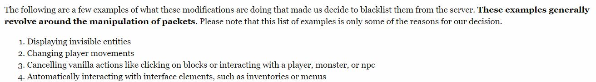
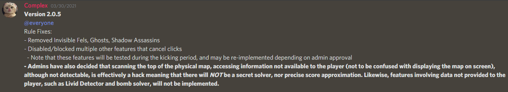
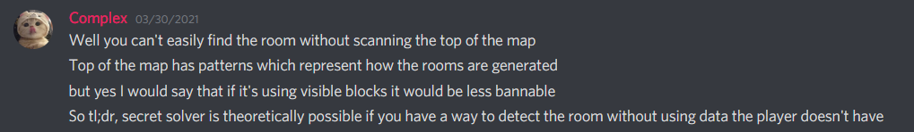

## Overview/TL;DR
 Secret Waypoints for Hypixel Skyblock Dungeons have been added into Dungeon Rooms Mod with the release v2.0.0 on June 11th, 2021.
 - Based on the general interpretation of Hypixel's rules, the Dungeon Rooms Mod's Secret Waypoints are **not** bannable
 - As with all mods on the Hypixel network, this mod is still use at your own risk
 - There are some people who interpret the rules differently, and believe this mod should be disallowed
 
 _Note to admins: If there are any Hypixel admins reading this who disagree with my interpretation, please message my Discord \_risk#2091, or my forums account, so we can discuss._

---

## Background Info
 Before we begin, there are a few important things which you should note. 

 - This mod is not an ESP, meaning it does not directly scan for secrets. The mod places secret waypoints is based on a set of static coordinates for each room. The mod then calculates a corner of that room and makes that the origin point, then does some mathematical magic to convert the relative coordinates into the actual coordinates where the waypoints are placed.  
 The list of static coordinates which the mod uses to place waypoints is available [at this link](https://github.com/Quantizr/DungeonRoomsMod/blob/main/src/main/resources/assets/dungeonrooms/secretlocations.json).

 - This mod does not modify packets in any way, and is completely undetectable to Watchdog. There are exactly two ways the admins could ban a player for using this mod, if they do deem it disallowed (unlikely).  
 **I would like to reiterate that it is highly unlikely the admins would do these two things without warning.**
   1. If you stream, record, or otherwise screenshare yourself playing with waypoints enabled.
   2. If the admins blacklist the mod ID. Whenever a player using Forge mods connects to a server, it sends the server a list of the mods they are using, including Dungeon Rooms Mod. If the admins choose, they can ban anyone connecting to the server with a certain mod ID (this is how they security banned players using JED). IMO, it would be very irresponsible of the admins to do so, because players using v1 of this mod have the same mod ID but no Secret Waypoints, but would also be banned in the same group.  

## Hypixel's Allowed Modifications Rules

 Hypixel's Allowed Modifications Guide can be found [here](https://hypixel.net/threads/guide-allowed-modifications.345453/)
 As a summary of the above link, mods cannot do the following three things:
 1. The mod cannot provide an unfair advantage.
 2. The mod cannot automate any player movement, gameplay, etc.
 3. The mod cannot modify or alter packets.

 This mod does not automate anything or alter packets, so this mod is safe based on the second and third guidelines. The first guideline regarding providing unfair advanatages is the most contentious. 

 However, I would like to first draw attention to Experimentation Table Solvers, which the admin Dctr confirmed were allowed, as long as the solver did not automatically click for the player. Experimentation Table Solvers allow a player to memorize patterns far longer than what is humanly possible (e.g. 99.99% of humans will never be able to memorize a sequence of a length up to 49 in the Chronomatron addon without outside help). This is obviously an unfair advantage, but supposedly the admins allowed it because it didn't modify packets or automate behavior, thus making it undetectable.

 On the other hand, a player _can_ memorize all secrets - in fact the majority of top dungeon players have indeed memorized secrets for every room. This alone makes the Dungeon Rooms Mod less of an unfair advantage than Experimentation solvers. Furthermore, players who memorized pathing for secrets will be able to find secrets faster than someone using waypoints, so this still gives competitive players who are not using this mod an advantage.

 As with Experimentation Table solvers, the Dungeon Rooms Mod does not modify packets or automate behavior, so using the same logic the admins applied to Experimentation Table Solvers, Secret Waypoints should be allowed. If Secret Waypoints were to be disallowed, any mod that has Experimentation Table Solvers (DSM, NEU, Skytils, SBE) would all have to be disallowed by the same logic.

## Simon @ Hypixel's Comments on Waypoints
  On June 3, 2020, Simon (the owner of Hypixel) replied to a tweet, confirming that waypoints in general were allowed on the Hypixel network.
  <blockquote class="twitter-tweet">
Not sure, I’m just usin what lunar offers xD
&mdash; Epaxial (@EpaxiaI) <a href="https://twitter.com/EpaxiaI/status/1266206713864224768?ref_src=twsrc%5Etfw">May 29, 2020</a></blockquote><blockquote class="twitter-tweet">
Not bannable, enjoy
&mdash; Simon @ Hypixel (@Simon_Hypixel) <a href="https://twitter.com/Simon_Hypixel/status/1268370720528138240?ref_src=twsrc%5Etfw">June 4, 2020</a></blockquote> 
 
 Following this, Youtubers such as ThirtyVirus began using waypoints for Fairy Souls.
 

 Soon after, popular mods such as Moulberry's NEU (60k+ members in their Discord) added Fairy Soul Waypoints to their mod. Their waypoints work by dynamically checking what island type a player is on, then displaying the corresponding waypoints for that island. The waypoint then disappears when the fairy soul is clicked. 

 This is incredibly similar to what Dungeon Rooms Mod's Secret Waypoints do. The Secret Waypoints dynamically check what room a player is in, then display the corresponding waypoints for that room, with the waypoints disappearing when the secrets are clicked.

 Since Fairy Soul Waypoints have been confirmed as allowed, and since the Secret Waypoints in Dungeon Rooms Mod share many characteristics with Fairy Soul Waypoints, it follows that Dungeon Rooms Mod should also be allowed.

## Fr0z3n's QoL Modifications Guidelines
 On March 16, 2021, the Hypixel admin Fr0z3n posted [Update to Disallowed Modifications - QoL Modifications](https://hypixel.net/threads/update-to-disallowed-modifications-qol-modifications.4043482/), clarifying what was allowed and disallowing certain modifications.

 The relevant part of the post is shown below:
 
 
 Most important is the line "These examples generally revolve around the manipulation of packets." **Dungeon Rooms Mod does not modify packets in any way.** As such, this mod follows Fr0z3n's QoL guidelines. 

 As for the individual points, this mod does not display invisible entities. The waypoints are based on hardcoded relative coordinates [(see this)](https://github.com/Quantizr/DungeonRoomsMod/blob/main/src/main/resources/assets/dungeonrooms/secretlocations.json), not entities which the player can't see. Also, as stated earlier, the mod does not automate or change player movement, change actions, or cancel interactions, it only adds additional waypoints.

## ThirtyVirus and Badlion Client Dev's Opinions
 On May 29, 2021, ThirtyVirus did a stream titled "the LAST time I will be bad at dungeons", in which he expressed his wishes for Secret Waypoints. As ThirtyVirus gets payed good money from Badlion, he is obligated to hate Forge mods such as this one, so he suggested to the Badlion devs that they add Secret Waypoints. ThirtyVirus then reads a conversation between Badlion Devs regarding whether Secret Waypoints would be allowed, which is clipped [here](https://youtube.com/clip/UgxRUOo-C8eLMbiq3tl4AaABCQ).  
 Transcript:
 > Badlion Dev 1: it [Secret Waypoints] is allowed  
 Badlion Dev 2: all the highlighting stuff and showing where to go?  
 Badlion Dev 1: yep  
 Badlion Dev 2: so why were we worried in the first place?  
 Badlion Dev 1: because we weren't sure, we didn't get their approval until now

## Oh, but SBE Dev said this was bannable!!!
 With the release of SkyblockExtras 2.0.5, the devs of SBE also included an interesting bolded statement.
 
 Seeing as Dungeon Rooms Mod is the only widely used mod that scans the top of the physical map, this is a very pointed statement directed at Dungeon Rooms Mod.
 (Just as a note for reference, the Dungeon Rooms Mod scans the top of the map for the sole purpose of detecting what room a player is in.)

 There are a few problems with his statement. First of all, the claim that "_Admins_ have also decided..." is not backed up by any public statement by the admins. Based on everything the admins have said publicly, along with all the rules, there is nothing that states that scanning blocks which are not visible to the player is disallowed in any way.

 The second more interesting point, is that the SBE devs narrowed down what was disallowed to just "scanning the top of the physical map," not just blocks which are not visible to the player. **They cleverly omitted the fact that SBE scans for blocks (specifically pistons) which are invisible to the player for their water puzzle solver.** If they choose to follow what the admins supposedly told them (and them alone), they should probably also disable their water puzzle solver.

 The SBE dev also clarified on what specifically makes Secret Waypoints bannable.
 
 He claims that it would be "less bannable" if it could be done using visible blocks.

 Why does where the mod scans for blocks matter? A player who has memorized rooms and secrets can look at a room and easily tell which room it is. Sure, the player can't see the top of the map, but the player can tell just as easily what a particular room is just by looking at the room. It's not like being able to see the top of the map would provide any advantage in being able to tell which room a player is in.

 It was originally more straightforward to implement top of the map scanning for room detection. However, there is a relatively easy way to do room detection without scanning the top of the map. It would take about two weeks to implement, but would result in **no** noticeable difference to the player. 

 **Does it really matter where the mod scans for blocks if it doesn't affect the end result?**

## Summary
 Again, as with all mods on Hypixel, Dungeon Rooms Mod is use at your own risk. But, based on everything listed above, the Secret Waypoints within the Dungeon Rooms Mod are most likely **not** bannable.

 ---

 **Dungeon Rooms Mod Links:**

 Discord: https://discord.gg/kr2M7WutgJ

 Github: https://github.com/Quantizr/DungeonRoomsMod

---

 _For the last time, if there are any Hypixel admins reading this who disagree with my interpretation, please message my Discord \_risk#2091, or my forums account, so we can discuss._  
 _I am more than happy to change the scanning from top of the map to visible blocks, if you believe that it is necessary._